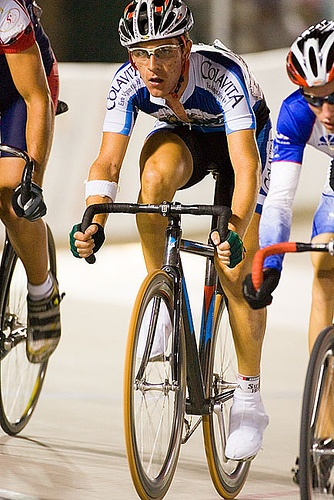

# Class Based Fast Style Transfer

This is a project created as a requirement for [ECE 285: Introduction to Visual Learning](https://xiaolonw.github.io/ece285/sp23/).

## Objective

Various methods for style transfer and image segmentation exist. Style transfer is carried out in an unsupervised learning problem, where a style image and a content image are provided as inputs to a network. Content loss and style loss are used to transfer the style from style image to content image. But this is a time consuming process, multiple iterations are required for a single image to obtain the desired styling.

# Approach
## Fast Style Transfer

We use the method defined in [Perceptual Losses for Real-Time Style Transfer and Super-Resolution](https://arxiv.org/abs/1603.08155) along with [Instance Normalization](https://arxiv.org/pdf/1607.08022.pdf). For reference, we use this [Fast Neural Style GitHub Repo](https://github.com/pytorch/examples/blob/main/fast_neural_style/README.md)

This method makes use of popular datasets created for feature extraction and object detection, along with VGG16 layers, to train a network to understand a single style image. This network takes as input 2 images, a fixed style image, and an image from the dataset. All images from the chosen dataset are used to train the model, against a fixed style. Depending on the epochs, network size, datset size etc. the model may take some time to train. But with such a pretrained model, we were able to perform style tranfer at approximately 25fps on Google Colaboratory with Tesla T4 GPU.

We have modified the network by reducing the size and removing residual blocks, which has resulted in the model running faster and even reflecting more of the style image in the output.

## Segmentation

# Running the code
The code has been designed to be able to:
1. [run class based style transfer](#run_pipeline)
2. [train style transfer models](#train_style)
3. [run a style transfer model](#run_style)
4. [train segmentation models.](#train_segmentation)

##  1. Running the entire pipeline
The file `main.py` is used to run the entire pipeline. The image or images on which CBS needs to be performed and the models to be used are needed. The command for this is of the format:

    python main.py -images_path _path_to_images_ -classname _model_path_

where classname could be any class that the model can predict. We are using cityscape dataset, which has the following classes:

    ├── Road
    ├── Sidewalk
    ├── Building
    ├── Wall
    ├── Fence
    ├── Pole
    ├── Traffic Light
    ├── Traffic Sign
    ├── Vegetation
    ├── Terrain
    ├── Sky
    ├── Person
    ├── Rider
    ├── Car
    ├── Truck
    ├── Bus
    ├── Train
    ├── Motorcycle
    └── Bicycle

These classes can be used with a `-`(hyphen) prefix, followed by the name of the model to be used. For example:

    python main.py -images_path './datasets/citys/leftImg8bit/test/mainz' -road ./style_transfer/models/changed_model_2_udnie_trained_model.model -sky ./style_transfer/models/changed_model_2_starry_night_trained_model.model

## Training style transfer
Style transfer models can be trained using a generic dataset of images and one or more style images. A generic set of images helps generalize the features on which the model is trained. To train an image on a single style:

    python style_transfer_main.py train -train _path_to_training_folder_ -styles _path_to_style_image_

The path given for training images needs to contain a **folder** with all required images.

    python style_transfer_main.py train -train './JPEGImages' -styles './style_transfer/style_images/mosaic.jpg'

Multiple images can be used to train a single image. This is an experiment done to observe whether the style of an artist can be replicated from multiple artworks belonging to them. Use the command `-single_style` when training such a model.

    python style_transfer_main.py train -train './JPEGImages' -styles './style_transfer/changed_model_2_wassily_kandinsky_styles' -single_style

## Using a trained style transfer model
A trained model can be used with a folder containing images to perform style transfer with the following command:

    python style_transfer_main.py style -model _path_to_model_ -tostyle _path_to_images_

A folder named `styled`, containing all the styled images, is created.

    python style_transfer_main.py style -model './style_transfer/models/changed_model_2_The_Persistence_of_Memory_trained_model.model' -tostyle './style_transfer/Images/Images'

**Note:** Both `train` and `style` flags can be used together and the `train` command takes effect first before the `style` command

## Training a segmentation model
A segmentation model can only be trained using a Cityscape format Dataset. This dataset needs to have the structure:
    
    ├── datasets
    │   ├── citys
    │   │   ├── gtFine
    │   │   │   ├── test
    │   │   │   ├── train
    │   │   │   ├── val
    │   │   ├── leftImg8bit
    │   │   │   ├── test
    │   │   │   ├── train
    └───└───└───└── val

And the following command is to be used:

    python segment_main.py -train_segment

# Results
## Fast Style Transfer
We were able to train a style transfer model that runs at approximately 25fps giving the following results:

|Style|Original Image|Styled Image|
|---|---|---|
|||| 
||||

## Fast SCNN
|Original Image|Segmented Image|
|---|---|
||| 
|||

## Combined Pipeline
|Original Image|Stylized Image|
|---|---|
||| 
|||

# Ablation Study
We tried modifying the orignal network in the following ways:
* Removing encoder and decoder layers, and using only 64 layers for residual blocks
* Adding encoder and decoder layers, and using 256 layers for residual blocks
* Using batch normalization instead of instance normalization

The model with just 64 layers performed just as well as the original model, with slightly better results in some images. Here are the results:

|Original Image|Their Model|Our Model|Using BN|256 Layer Residual|
|---|---|---|---|---|
||||||
||||||